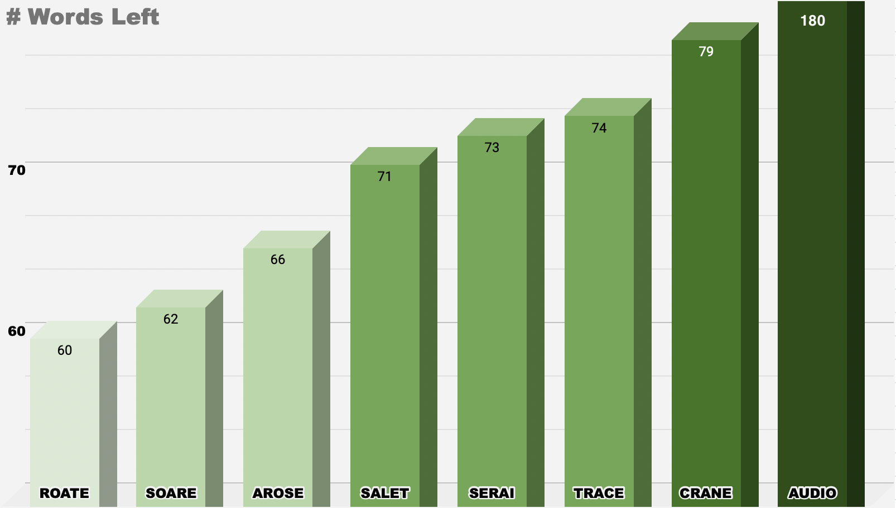
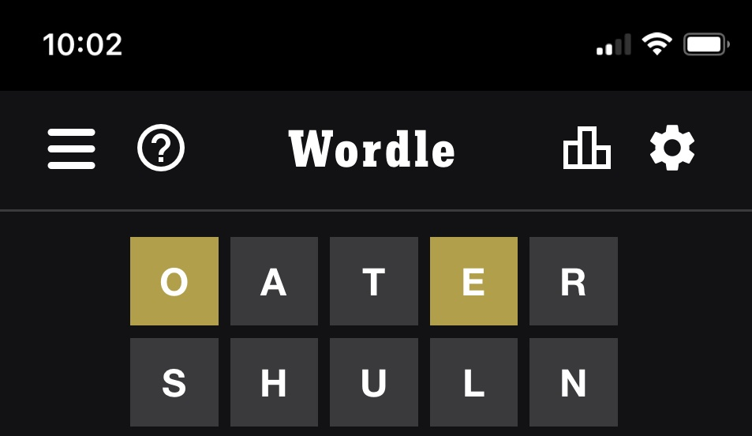
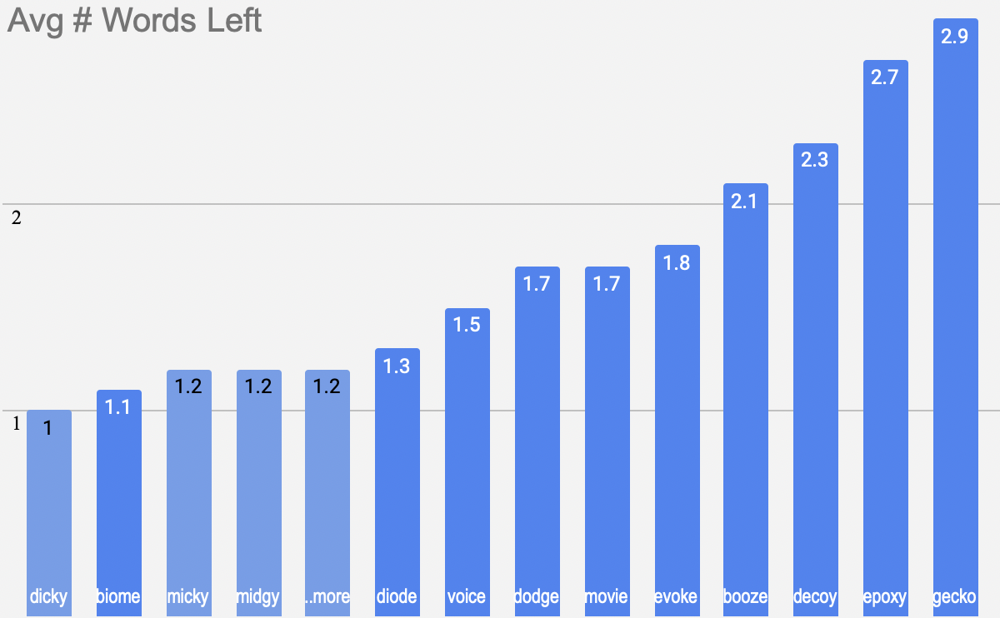
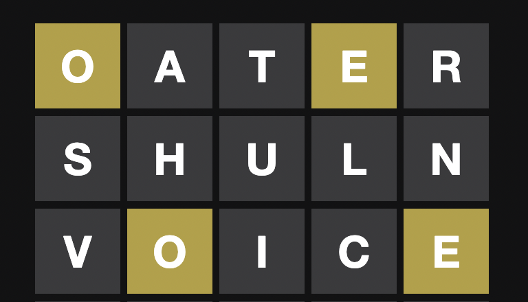
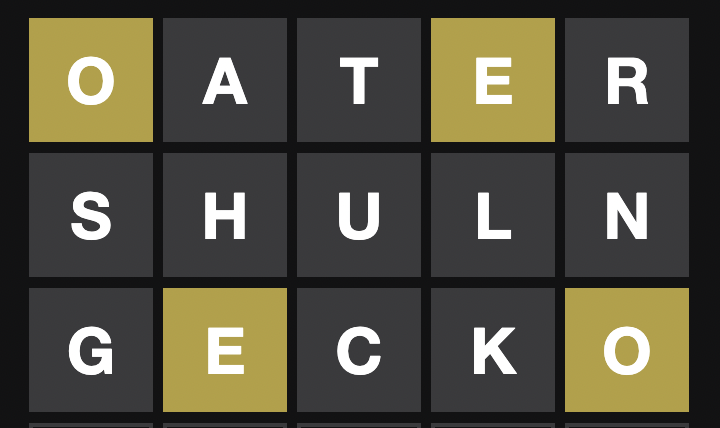

[Best opener](#best_opener)  
[Algorithm in one sentence](#algor)  
[Explanation](#explain)  
[Example](#ex)  
[Performance](#performance)

  

# Best Opener

>The world's best opening wordle guess

Many smarter than I have [proposed their best starting words]("https://thesmartlocal.com/read/best-wordle-words/")
- CRANE (3blue1brown Grant Sanderson)
- SOARE (3blue1brown Grant Sanderson update)
- SALET (Mathematician Alex Selby)
- TRACE (Data analyst Daniel Kats)
- SERAI (Data analyst Daniel Kats)
- AROSE (MrExcel.com)
- AUDIO (Community fav)

Here's an average of how many words would be left using these starting words against the 2,309 possible targets. (Lower is better)

Results first, explanation later

    

# Algorithm in One Sentence
> ## Use your guess to narrow down the possible answer set as much as possible  
`Whether it's the first guess with 2309 possible answers or the fourth guess with 3 possible answers, the algorithm will choose the shortest path to winning.`

    

# Explanation

Roate was played against all 2,309 Wordle targets. 

For each word, a result is produced. For example if the target answer for today was "fewer", this would be the result

Any time a result is given, it allows us to filter the possible set of targets remaining.  For instance with the above result we match targets that contain an *R and E* but do not *start with R* or *end with E*. 

That filtering leaves 102 targets left. 

`This was done for every single playable word (~13,000) vs every single Wordle target (~2300).`

    

# Example

`From this information alone we've narrowed our possible answer set down from the starting ~2300 words to 10 words. `

### The possible remaining words are
||||||
|---|---|---|---|---|
| voice | movie | biome | decoy | gecko |
| epoxy | dodge | booze | diode | evoke |

### Ideally, we would pick a word from the list that would either
1. Be correct
2. Narrow down the field to one other answer if incorrect
---

Our algorithm produces these results

- Light blue are the top 3 playable words followed by 20+ more combined into "..more" 
- Darker blue are the 10 target words remaining from the filter

Playing "dicky" against of the remaining 10 target words is *guaranteed* to filter the possible remaining words down to 1 option. 

Now what about "biome"?  It has an average remaining words count of 1.1, *plus* it gives you a chance to win on this turn since it comes from the target words. 

Lets look at the possible results from playing "biome"

## 4/2 To be continued...

<!-- These words are also in order of which guesses will narrow the field the most.  If we choose "voice"

## Possible remaining words
||
|---|
| epoxy |
---
Had we chosen something like 'gecko' we would have got
 

## Possible remaining words
|||||
|---|---|---|---|
| epoxy | dodge | booze | 

---
So the takeaway is given a list of equally likely possibilities, your best guess will be the one that narrows down the field the most.  

*** 3/27 Whether it would be better to use a word from the possible answers list vs a word from the possible guesses list is being addressed on the next update

*Using a word from the possible answers (~2,300) list gives you a chance of winning on the play, but less narrowing if your miss*

*Using a word from the allowable guesses (~13,000) list gives you zero chance of winning on the play but guaranteed to maximally narrow your remaining possibilities* 
 -->
